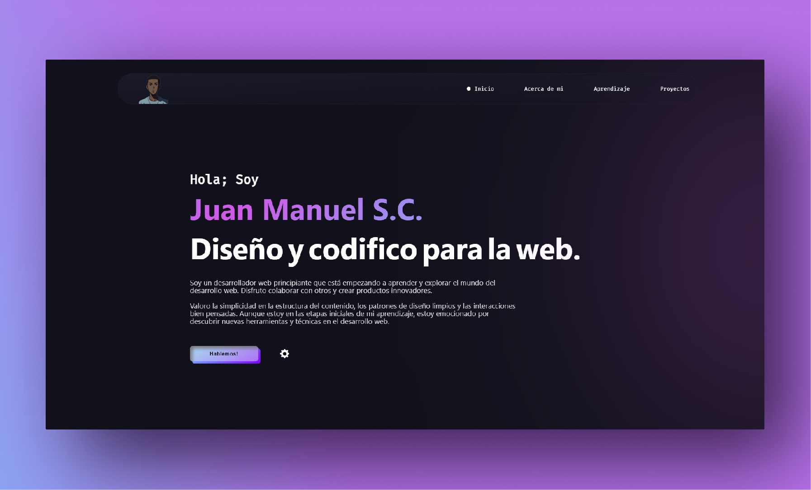

# <a href="https://zshiloh.github.io/Portafolio/" target="_blank">Mi Portafolio</a>

Este sitio web muestra mis proyectos, presencia en la web, Aprendizaje y informacion de contacto.

## Secciones 📚

-✔️ Mini Introducción
-✔️ Acerca de mi
-✔️ Habilidades
-✔️ Proyectos
-✔️ Contactos

## Tecnologías usadas 👨‍💻
| Tecnología | Versión   | Descripción                                                                     |
|------------|-----------|---------------------------------------------------------------------------------|
| HTML       | 5         | Lenguaje de Marcas que define el significado y la estructura del contenido web. |
| CSS        | 3         | Lenguaje de estilos utilizado para describir la presentación de documentos.     |
| JavaScript | ES14 2023 | Lenguaje de programación ligero, interpretado, o compilado justo-a-tiempo.      |

## Redes sociales 📱
- YouTube: https://www.youtube.com/@shiloh04/
- GitHub: https://github.com/zshiloh
- LinkedIn: https://www.linkedin.com/in/zshiloh/
- Instagram: https://www.instagram.com/zshiloh04/
